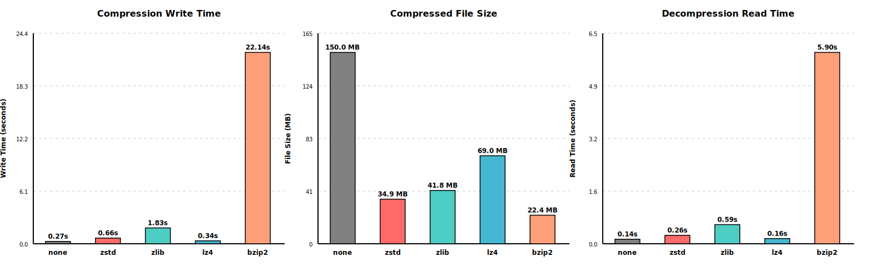
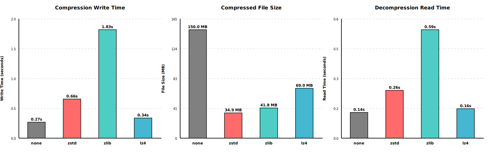

# NEP (NetCDF Expansion Pack)

**[📚 Full Documentation](https://intelligent-data-design-inc.github.io/NEP/)**

## High-Performance Compression + Multi-Format Data Access

NEP extends NetCDF-4 with powerful new capabilities for scientific data workflows:

- **Ultra-Fast LZ4 Compression**: 2-3x faster than DEFLATE with excellent compression ratios - ideal for real-time data processing and HPC workflows
- **High-Ratio BZIP2 Compression**: Superior compression for archival storage - reduce storage costs while maintaining data integrity
- **NASA CDF File Reader**: Access Common Data Format files directly through the familiar NetCDF API - no conversion needed
- **Drop-In Compatibility**: Works with existing NetCDF-4 applications without code changes

## Why NEP?

Scientific data producers need better tools to handle growing data volumes:

- **Storage Costs**: Petabyte-scale datasets require efficient compression without sacrificing performance
- **Processing Speed**: DEFLATE compression creates bottlenecks in data pipelines and analysis workflows
- **Data Format Silos**: CDF and NetCDF communities use different tools despite similar data structures
- **Limited Options**: NetCDF-4 needs more compression algorithms optimized for different use cases

## What NEP Delivers

### LZ4 Compression: Speed Without Compromise

**Performance**: 2-3x faster compression and decompression than DEFLATE while achieving 2.2x compression ratios on typical scientific datasets.

**Use Cases**:
- Real-time satellite data processing
- High-throughput simulation output
- Interactive data analysis workflows
- Cloud-based data pipelines

**How It Works**: LZ4 compression is provided as an HDF5 filter plugin. Simply set `HDF5_PLUGIN_PATH` and use standard NetCDF-4 compression APIs - no code changes required.

### BZIP2 Compression: Maximum Storage Efficiency

**Performance**: 6.7x compression ratios on scientific datasets - significantly better than DEFLATE for long-term archival storage.

**Use Cases**:
- Long-term data archives
- Reducing cloud storage costs
- Datasets with repetitive patterns
- Bandwidth-constrained data transfers

**How It Works**: Like LZ4, BZIP2 integrates as an HDF5 filter plugin with zero code changes to existing applications.

### CDF File Reader: Unified Data Access

**Capability**: Read NASA Common Data Format files using the NetCDF API you already know.

**Benefits**:
- No file conversion required - access CDF data directly
- Automatic type mapping (CDF types → NetCDF types)
- Support for TT2000 time variables and multi-dimensional arrays
- Unified analysis tools for both NetCDF and CDF datasets

**Use Cases**:
- Space physics and heliophysics research
- NASA mission data analysis (IMAP, MMS, Van Allen Probes)
- Cross-format data integration
- Legacy CDF data access in modern workflows

**How It Works**: NEP provides a User-Defined Format (UDF) handler that transparently reads CDF files through standard NetCDF functions like `nc_open()`, `nc_get_var()`, and `nc_get_att()`.

## Key Benefits

- **Choose Your Trade-Off**: Select LZ4 for speed or BZIP2 for compression ratio - optimize for your specific workflow
- **No Code Changes**: Drop-in replacement for existing NetCDF-4 applications via HDF5 filter plugins
- **Multi-Format Support**: Work with both NetCDF and CDF files using a single API
- **Production Ready**: Full CMake and Autotools build support, comprehensive test suites, CI validation
- **HPC Optimized**: Designed for large-scale scientific computing with Spack package manager support
- **Cost Savings**: Reduce storage and bandwidth costs without sacrificing data access performance

## Compression Performance

The following benchmarks compare compression methods on a 150 MB NetCDF-4 dataset. For comparison, I include ZSTD, which was recently added to NetCDF and provides better performance than ZLIB, though not as fast as LZ4:

### All Compression Methods



### Fast Compression Methods (Excluding BZIP2)

For better visualization of the faster compression methods:



| Method | Write Time (s) | File Size (MB) | Read Time (s) | Compression Ratio | Write Speed | Read Speed |
|--------|----------------|----------------|---------------|-------------------|-------------|------------|
| none   | 0.27          | 150.01         | 0.14          | 1.0×              | 1.0×        | 1.0×       |
| lz4    | 0.34          | 68.95          | 0.16          | 2.2×              | 0.79×       | 0.88×      |
| zstd   | 0.66          | 34.94          | 0.26          | 4.3×              | 0.41×       | 0.54×      |
| zlib   | 1.83          | 41.78          | 0.59          | 3.6×              | 0.15×       | 0.24×      |
| bzip2  | 22.14         | 22.39          | 5.90          | 6.7×              | 0.01×       | 0.02×      |

**Key Insights:**
- **LZ4** offers the best balance: 2.2× compression with minimal performance impact (79% write speed, 88% read speed)
- **ZSTD** (recently added to NetCDF) provides excellent compression (4.3×) with moderate performance impact (41% write speed, 54% read speed)
- **ZLIB** (standard DEFLATE) shows 3.6× compression but is slower than both LZ4 and ZSTD
- **BZIP2** achieves the highest compression ratio (6.7×) but is significantly slower (1% write speed, 2% read speed)
- **Read performance** generally mirrors write performance, with LZ4 being fastest and BZIP2 slowest

---

## CDF Reader

NEP includes support for reading NASA Common Data Format (CDF) files through a NetCDF-like API. CDF is a self-describing data format designed for the storage and manipulation of multi-dimensional data sets, widely used in space physics and solar research communities.

### What is CDF?

The Common Data Format (CDF) is a conceptually similar format to NetCDF, developed and maintained by NASA's Space Physics Data Facility (SPDF). CDF files are commonly used for storing time-series and multi-dimensional scientific data from space missions and ground-based observations.

**Key characteristics:**
- Self-describing format with metadata
- Support for multiple data types and dimensions
- Platform-independent binary format
- Optimized for space physics data

### Resources

- **[NASA CDF Homepage](https://cdf.gsfc.nasa.gov/)** - Official CDF library and documentation
- **[CDF C Reference Manual](https://spdf.gsfc.nasa.gov/pub/software/cdf/doc/cdf_C_RefManual.pdf)** - Complete C API reference

### CDF Support in NEP

NEP provides a User-Defined Format (UDF) handler that allows reading CDF files using NetCDF-style API calls. This enables applications to work with both NetCDF and CDF files through a unified interface.

To enable CDF support during build, use the `--enable-cdf` (Autotools) or `-DENABLE_CDF=ON` (CMake) configuration option. You must have the NASA CDF library installed on your system.

---

## GeoTIFF Reader

NEP v1.5.0 adds support for reading GeoTIFF files through the NetCDF API. GeoTIFF is a widely-used geospatial raster format that embeds geographic metadata within TIFF image files.

### What is GeoTIFF?

GeoTIFF is a public domain metadata standard that allows georeferencing information to be embedded within TIFF image files. It's the de facto standard for geospatial raster data exchange and is widely used in remote sensing, GIS applications, and Earth observation missions.

**Key characteristics:**
- Standard TIFF format with geospatial extensions
- Embedded coordinate reference system (CRS) information
- Support for various map projections and datums
- Multi-band raster data support
- Platform-independent format

### Resources

- **[GeoTIFF Homepage](https://www.geotiff.org/)** - Official GeoTIFF specification
- **[libgeotiff](https://github.com/OSGeo/libgeotiff)** - Open source GeoTIFF library

### GeoTIFF Support in NEP

NEP provides a User-Defined Format (UDF) handler that allows reading GeoTIFF files using NetCDF-style API calls. This enables applications to work with GeoTIFF, NetCDF, and CDF files through a unified interface.

**Current Features (Phase 1 & 2):**
- ✅ Automatic format detection - GeoTIFF files are recognized by magic number
- ✅ Open/close operations via standard `nc_open()` and `nc_close()` functions
- ✅ Metadata extraction - dimensions, data types, coordinate reference systems
- ✅ Support for both little-endian and big-endian TIFF files
- ✅ Multi-band and single-band raster support
- ⏳ Raster data reading (Phase 3 - planned)
- ⏳ Coordinate transformations (Phase 4 - planned)

**Usage Example:**

```c
#include <netcdf.h>

int ncid, ndims, nvars, natts;
int retval;

/* Open GeoTIFF file - automatically detected */
if ((retval = nc_open("satellite_image.tif", NC_NOWRITE, &ncid)))
    ERR(retval);

/* Query file metadata */
if ((retval = nc_inq(ncid, &ndims, &nvars, &natts, NULL)))
    ERR(retval);

printf("Dimensions: %d, Variables: %d, Attributes: %d\n", 
       ndims, nvars, natts);

/* Get dimension information */
char dim_name[NC_MAX_NAME + 1];
size_t dim_len;
for (int i = 0; i < ndims; i++) {
    if ((retval = nc_inq_dim(ncid, i, dim_name, &dim_len)))
        ERR(retval);
    printf("Dimension %d: %s = %zu\n", i, dim_name, dim_len);
}

/* Close file */
if ((retval = nc_close(ncid)))
    ERR(retval);
```

**Build Configuration:**

To enable GeoTIFF support during build, use the `--enable-geotiff` (Autotools) or `-DENABLE_GEOTIFF=ON` (CMake) configuration option. You must have libgeotiff and libtiff installed on your system.

```bash
# CMake
cmake -B build -DENABLE_GEOTIFF=ON

# Autotools
./configure --enable-geotiff
```

**Useful Tools for Working with GeoTIFF Files:**

```bash
# Essential tools for GeoTIFF inspection and manipulation
sudo apt install gdal-bin        # GDAL command-line utilities
sudo apt install libtiff-tools   # TIFF utilities (tiffinfo, tiffdump)
sudo apt install qgis            # GUI for viewing/analyzing GeoTIFF files (optional)
```

**Key GDAL commands:**
- `gdalinfo <file.tif>` - Display detailed file information (bands, CRS, metadata)
- `gdal_translate` - Convert between formats and extract subsets
- `gdalwarp` - Reproject and transform raster data
- `gdal_merge.py` - Merge multiple GeoTIFF files

**Key libtiff commands:**
- `tiffinfo <file.tif>` - Display TIFF structure and tags
- `tiffdump <file.tif>` - Dump TIFF directory contents
- `tiffcp` - Copy and convert TIFF files

**Example usage:**
```bash
# Check if a file is multi-band
gdalinfo satellite_image.tif | grep "Band"

# View planar configuration
tiffinfo satellite_image.tif | grep "Planar Configuration"

# Get basic file info
tiffinfo satellite_image.tif | grep -E "(Image Width|Image Length|Samples)"
```

**Use Cases:**
- NASA Earth observation data (MODIS, Landsat, Sentinel)
- Satellite imagery analysis
- Digital elevation models (DEMs)
- Land cover classification maps
- Climate and weather model outputs
- Integration of GIS data with NetCDF workflows

---

## Installation

### Prerequisites

NEP v1.5.0 requires the following dependencies:

- **NetCDF-C library** (v4.9+)
- **HDF5 library** (v1.12+)
- **CMake** (v3.9+) or **Autotools** for building
- **LZ4 library** for LZ4 compression support
- **BZIP2 library** for BZIP2 compression support
- **NetCDF-Fortran** (optional, for Fortran wrappers)
- **NASA CDF library** (v3.9+, optional, for CDF file support)
- **libgeotiff** (latest stable, optional, for GeoTIFF file support)
- **libtiff** (latest stable, optional, required by libgeotiff)
- **Doxygen** (optional, for building documentation)

### Spack Installation (Recommended for HPC)

NEP and CDF can be installed using Spack for simplified dependency management:

```bash
# Install NEP with all features
spack install nep

# Install NEP with minimal features
spack install nep~docs~fortran

# Install CDF library separately
spack install cdf

# Load packages
spack load nep
spack load cdf
```

**Status**: NEP and CDF packages submitted to spack/spack-packages repository (PR pending approval).

For more details on Spack installation options and variants, see **[Spack Installation Guide](docs/spack.md)**.

### Test Data

NEP includes comprehensive test suites with real-world sample data files located in `test/data/`:

#### CDF Test Files

**`imap_mag_l1b-calibration_20240229_v001.cdf`** (3.2 KB)
- NASA IMAP (Interstellar Mapping and Acceleration Probe) magnetometer calibration data
- L1B calibration dataset from February 29, 2024
- Contains multi-dimensional arrays and TT2000 time variables
- Used for testing CDF UDF handler functionality
- Source: NASA Space Physics Data Facility (SPDF)

**`imap_mag_cdfdump.txt`** (8.9 KB)
- Reference output from NASA's `cdfdump` utility for validation
- Used to verify correct metadata extraction and data reading

#### GeoTIFF Test Files

**`MCDWD_L3_F1C_NRT.A2025353.h00v02.061.tif`** (41 KB)
- MODIS/Aqua+Terra Global Flood Product (tile h00v02)
- Single-band raster: 4800×4800 pixels, 8-bit unsigned integer
- Resolution: 250m (~0.002° pixel size)
- Coverage: 70°N to 60°N latitude, 180°W to 170°W longitude
- Planar configuration: Single image plane (PLANARCONFIG_CONTIG)
- Used for testing GeoTIFF single-band reading and organization detection

**`MCDWD_L3_F1C_NRT.A2025353.h00v03.061.tif`** (383 KB)
- MODIS/Aqua+Terra Global Flood Product (tile h00v03)
- Single-band raster: 4800×4800 pixels, 8-bit unsigned integer
- Resolution: 250m (~0.002° pixel size)
- Coverage: 60°N to 50°N latitude, 180°W to 170°W longitude
- Planar configuration: Single image plane (PLANARCONFIG_CONTIG)
- Used for testing GeoTIFF reading with different data patterns

**Data Source:** NASA LANCE (Land, Atmosphere Near real-time Capability for EOS)
- Product: MCDWD_L3_F1C_NRT v6.1
- Description: 1-day composite flood detection with cloud shadow masks
- DOI: 10.5067/MODIS/MCDWD_L3_F1C_NRT.061

**`ABBA_2022_C61_HNL.tif`** (5.4 MB)
- Arctic Boreal Annual Burned Area for 2022 (tile HNL)
- Single-band raster: 55,877×41,013 pixels, 8-bit unsigned integer with palette
- Resolution: 463m pixel size in Sinusoidal projection
- Coverage: Circumpolar boreal forest and tundra regions above 50°N
- Planar configuration: Single image plane (PLANARCONFIG_CONTIG)
- Cloud-optimized GeoTIFF with multiple overview levels
- Used for testing large GeoTIFF files and tiled organization
- Citation: Loboda, T. V., Hall, J. V., Chen, D., Hoffman-Hall, A., Shevade, V. S., Argueta, F., & Liang, X. (2024). Arctic Boreal Annual Burned Area, Circumpolar Boreal Forest and Tundra, V2, 2002-2022 (Version 2). ORNL Distributed Active Archive Center. https://doi.org/10.3334/ORNLDAAC/2328 Date Accessed: 2025-12-30

**Note:** Current test files are single-band GeoTIFFs. For testing multi-band raster reading (Phase 3.3), additional test files with multiple bands (e.g., Landsat, Sentinel-2) are recommended. See the GeoTIFF section above for data sources.

### CMake Build and Installation

```bash
# Configure
cmake -B build -DCMAKE_INSTALL_PREFIX=/usr/local

# Build
cmake --build build

# Build documentation (optional)
cmake --build build --target docs

# Install
cmake --install build

# Uninstall (if needed)
cmake --build build --target uninstall
```

**Note:** If HDF5 is installed in a non-standard location, you may need to specify `HDF5_ROOT`:

```bash
cmake -B build -DHDF5_ROOT=/path/to/hdf5 -DCMAKE_INSTALL_PREFIX=/usr/local
```

For example, if HDF5 is installed in `/usr/local/hdf5-1.14.6`:

```bash
cmake -B build -DHDF5_ROOT=/usr/local/hdf5-1.14.6 -DCMAKE_INSTALL_PREFIX=/usr/local
```

### Autotools Build and Installation

```bash
# Bootstrap and configure
./autogen.sh
./configure --prefix=/usr/local --enable-lz4 --enable-bzip2

# Build
make

# Build documentation (optional)
make docs

# Install
make install

# Uninstall (if needed)
make uninstall
```

### Configuration Options

| CMake Option | Autotools Option | Default | Description |
|--------------|------------------|---------|-------------|
| `-DBUILD_DOCUMENTATION=ON/OFF` | `--enable-docs/--disable-docs` | ON/enabled | Build API documentation |
| `-DENABLE_FORTRAN=ON/OFF` | `--enable-fortran/--disable-fortran` | ON/enabled | Fortran wrappers and tests |
| `-DENABLE_CDF=ON/OFF` | `--enable-cdf/--disable-cdf` | OFF/disabled | CDF UDF handler build (v1.3.0+) |
| `-DENABLE_GEOTIFF=ON/OFF` | `--enable-geotiff/--disable-geotiff` | OFF/disabled | GeoTIFF UDF handler build (v1.5.0+) |
| N/A | `--enable-lz4/--disable-lz4` | enabled | LZ4 compression support |
| N/A | `--enable-bzip2/--disable-bzip2` | enabled | BZIP2 compression support |

**Note on CDF Support (v1.3.0):** The `--enable-cdf` option enables building the CDF UDF handler library (`libnccdf`) with full read support for CDF files. To use this option, you must have the NASA CDF library installed. Download from: https://spdf.gsfc.nasa.gov/pub/software/cdf/dist/latest/

The CDF UDF handler library is installed to `${prefix}/lib/libnccdf.so` (CMake) or `${prefix}/lib/libnccdf.la` (Autotools) when CDF support is enabled.

**Spack Users:** Install CDF separately with `spack install cdf` (v1.4.0+). The CDF variant will be added back to the NEP Spack package once the CDF package is accepted into the main Spack repository.

### Using NEP in Your Project

LZ4 and BZIP2 compression are provided as HDF5 filter plugins. Simply set the `HDF5_PLUGIN_PATH` environment variable to the NEP installation directory, and use standard NetCDF-4 compression APIs.

```bash
export HDF5_PLUGIN_PATH=/usr/local/lib/plugin
```

---

## Documentation

For more detailed information about the project:

- **[PR/FAQ](docs/prfaq.md)** - Press release and frequently asked questions
- **[Roadmap](docs/roadmap.md)** - Development roadmap and release schedule
- **[Product Requirements](docs/prd_1.md)** - Detailed product requirements and specifications (v1.0.0)
- **[Design Document](docs/design_1.md)** - Technical architecture and design details (v1.0.0)

---
