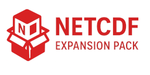
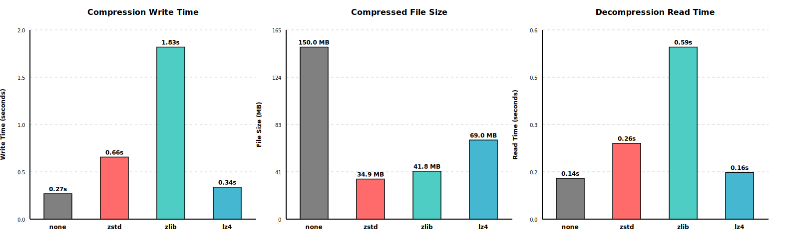

# NEP (NetCDF Expansion Pack)

**[📚 Full Documentation](https://intelligent-data-design-inc.github.io/NEP/)**

---

## Summary

NEP extends NetCDF-4 with powerful new capabilities:
* more compression filters
* read layers for different data formats
* extra examples covering advanced netCDF use

### Compression

| Algorithm | Description | Best For |
|---|---|---|---|
| **LZ4** | Faster than zstandard | Real-time processing, HPC I/O |
| **BZIP2** | Very slow writes but best compression | Long-term archives, bandwidth-limited |

### Multi-Format Readers

| Format | Domain |
|---|---|
| **NASA CDF** | Space physics (IMAP, MMS, Van Allen) |
| **GeoTIFF** | Geospatial rasters, CF-1.8 CRS metadata |
| **GRIB2** | NWP model output (GFS, NAM, HRRR, wave) |
| **FITS** | Astronomical images and tables (HST, JWST) |
| **PDS4** | NASA/ESA planetary science (Mars, Moon, etc.) |

All readers use the standard NetCDF UDF system and are **opt-in at build time** (default OFF). Once enabled, **existing C and Fortran programs require no code modification** — an existing Fortran program that calls `nf90_open()` and `nf90_get_var()` can read a FITS, CDF, GeoTIFF, GRIB2, or PDS4 file without changing a single line of code. NEP registers the format handler at startup; the rest of the program stays identical.

Enable one or more readers at configure time:

```bash
# CMake
cmake -B build \
  -DENABLE_GEOTIFF=ON \
  -DENABLE_GRIB2=ON \
  -DENABLE_CDF=ON \
  -DENABLE_FITS=ON \
  -DENABLE_PDS4=ON

# Autotools
./configure \
  --enable-geotiff \
  --enable-grib2 \
  --enable-cdf \
  --enable-fits \
  --enable-pds4
```

### Example Programs

NEP includes over 26 C and Fortran example programs, organized by topic. They are companion code for *[The NetCDF Developer's Handbook: The Authoritative Guide to Writing High-Performance Programs for Scientific Data Management, Second Edition](https://www.amazon.com/dp/B0H7Q1Z75L)*.

| Category | Examples |
|---|---|
| **Classic NetCDF** | Quickstart, 2D arrays, coord vars, format variants, unlimited dims |
| **NetCDF-4** | Compression, chunking, groups, compound/enum types, multiple unlimited dims |
| **NcZarr** | Local store create/read/write, chunking, deflate compression |
| **Performance** | Chunk cache tuning, chunking strategy comparison, compression benchmarking |
| **Parallel I/O** | MPI-based parallel write and read |

Both C and Fortran versions provided for Classic, NetCDF-4, and NcZarr categories.

---

## What NEP Delivers

### LZ4 Compression: Speed Without Compromise

**Performance**: 2-3x faster compression and decompression than DEFLATE while achieving 2.2x compression ratios on typical scientific datasets.

**Use Cases**:
- Real-time satellite data processing
- High-throughput simulation output
- Interactive data analysis workflows
- Cloud-based data pipelines
**How It Works**: LZ4 compression is provided as an HDF5 filter plugin. Simply set `HDF5_PLUGIN_PATH` and call nc_def_var_lz4() to turn on LZ4 compression

### BZIP2 Compression: Maximum Storage Efficiency

**Performance**: 6.7x compression ratios on scientific datasets - significantly better than DEFLATE for long-term archival storage.

**Use Cases**:
- Long-term data archives
- Reducing cloud storage costs
- Datasets with repetitive patterns
- Bandwidth-constrained data transfers

**How It Works**: Like LZ4, BZIP2 integrates as an HDF5 filter plugin. Call nc_def_var_bzip2() to turn on BZIP2 compression for a variable.

## Compression Performance

The following benchmarks compare compression methods on a 150 MB NetCDF-4 dataset.

### All Compression Methods


### Fast Compression Methods (Excluding BZIP2)

For better visualization of the faster compression methods:



| Method | Write Time (s) | File Size (MB) | Read Time (s) | Compression Ratio | Write Speed | Read Speed |
|--------|----------------|----------------|---------------|-------------------|-------------|------------|
| none   | 0.27          | 150.01         | 0.14          | 1.0×              | 1.0×        | 1.0×       |
| lz4    | 0.34          | 68.95          | 0.16          | 2.2×              | 0.79×       | 0.88×      |
| zstd   | 0.66          | 34.94          | 0.26          | 4.3×              | 0.41×       | 0.54×      |
| zlib   | 1.83          | 41.78          | 0.59          | 3.6×              | 0.15×       | 0.24×      |
| bzip2  | 22.14         | 22.39          | 5.90          | 6.7×              | 0.01×       | 0.02×      |

**Key Insights:**
- **LZ4** offers the best balance: 2.2× compression with minimal performance impact (79% write speed, 88% read speed)
- **ZSTD** (recently added to NetCDF) provides excellent compression (4.3×) with moderate performance impact (41% write speed, 54% read speed)
- **ZLIB** (standard DEFLATE) shows 3.6× compression but is slower than both LZ4 and ZSTD
- **BZIP2** achieves the highest compression ratio (6.7×) but is significantly slower (1% write speed, 2% read speed)
- **Read performance** generally mirrors write performance, with LZ4 being fastest and BZIP2 slowest

---

## CDF Reader

NEP includes support for reading NASA Common Data Format (CDF) files through a NetCDF-like API. CDF is a self-describing data format designed for the storage and manipulation of multi-dimensional data sets, widely used in space physics and solar research communities.

### What is CDF?

The Common Data Format (CDF) is a conceptually similar format to NetCDF, developed and maintained by NASA's Space Physics Data Facility (SPDF). CDF files are commonly used for storing time-series and multi-dimensional scientific data from space missions and ground-based observations.

**Key characteristics:**
- Self-describing format with metadata
- Support for multiple data types and dimensions
- Platform-independent binary format
- Optimized for space physics data

### Resources

- **[NASA CDF Homepage](https://cdf.gsfc.nasa.gov/)** - Official CDF library and documentation
- **[CDF C Reference Manual](https://spdf.gsfc.nasa.gov/pub/software/cdf/doc/cdf_C_RefManual.pdf)** - Complete C API reference

### CDF Support in NEP

NEP provides a User-Defined Format (UDF) handler that allows reading CDF files using NetCDF-style API calls. This enables applications to work with both NetCDF and CDF files through a unified interface.

To enable CDF support during build, use the `--enable-cdf` (Autotools) or `-DENABLE_CDF=ON` (CMake) configuration option. You must have the NASA CDF library installed on your system. CDF defaults OFF.

---

## GeoTIFF Reader

GeoTIFF is the de facto standard for geospatial raster data, embedding coordinate reference system (CRS) information directly in a TIFF file. It is widely used in remote sensing, GIS, and Earth observation (MODIS, Landsat, Sentinel, DEMs).

### GeoTIFF Support in NEP

NEP provides a UDF handler that reads GeoTIFF (and BigTIFF) files through the standard NetCDF API, with CF-1.8 compliant CRS metadata, coordinate variables (`lon`/`lat` or `x`/`y`), coordinate bounds, and full hyperslab support. See [docs/cf-compliance.md](docs/cf-compliance.md) for the CF grid-mapping attribute specification.

To enable GeoTIFF support at build time:

```bash
cmake -B build -DENABLE_GEOTIFF=ON   # CMake
./configure --enable-geotiff          # Autotools
```

Requires libgeotiff and libtiff. GeoTIFF defaults OFF.

---

## GRIB2 Reader

GRIB2 is the standard binary format used by NOAA, ECMWF, and other agencies to distribute NWP model output and wave forecast data (GFS, NAM, HRRR, GDAS). Each GRIB2 product is exposed as a named `NC_FLOAT` variable on shared `[y, x]` dimensions; land/masked points are filled with `_FillValue = 9.999e20f`.

### GRIB2 Support in NEP

NEP provides a UDF handler that reads GRIB2 files through the standard NetCDF API. `ncdump` works directly on `.grib2` files once NEP is installed. Variable names come from the GRIB2 parameter abbreviation; per-variable attributes include `long_name`, `_FillValue`, and GRIB2 discipline/category/parameter metadata.

To enable GRIB2 support at build time:

```bash
cmake -B build -DENABLE_GRIB2=ON   # CMake
./configure --enable-grib2          # Autotools
```

Requires NOAA NCEPLIBS-g2c (>= 2.1.0) and libjasper (>= 3.0.0). GRIB2 defaults OFF. Starting with v2.2.0, GRIB2 and CDF can be enabled together.

---

## FITS File Reader

FITS (Flexible Image Transport System) is the standard format used by NASA, ESA, and the astronomical community for images, spectra, and tables from instruments such as the Hubble Space Telescope, Chandra X-ray Observatory, and the James Webb Space Telescope.

### FITS Support in NEP

NEP provides a UDF handler that reads FITS files through the standard NetCDF API. The primary HDU image appears as a variable in the root group; extension HDUs each become a child group named from `EXTNAME`. Standard FITS keywords are mapped to netCDF attributes (`BUNIT`→`units`, `BZERO`→`add_offset`, `BSCALE`→`scale_factor`). Dimension order reversal (FITS column-major ↔ netCDF row-major) is handled automatically.

To enable FITS support at build time:

```bash
cmake -B build -DENABLE_FITS=ON   # CMake
./configure --enable-fits          # Autotools
```

Requires CFITSIO (>= 3.0). FITS defaults OFF.

---

## PDS4 Reader

PDS4 (Planetary Data System version 4) is the data standard maintained by NASA's
Planetary Data System and ESA for archiving and distributing planetary science data —
Mars rover images, lunar surface DEMs, asteroid spectra, and more.

### PDS4 Support in NEP

NEP provides a UDF handler (v2.2.0) that opens PDS4 XML label files through the
standard NetCDF API. The handler parses the XML label with **libxml2** and
validates the PDS4 namespace (`http://pds.nasa.gov/pds4/pds/v1`).

PDS4 arrays and tables can be read via `nc_get_vara()`:
- `Identification_Area` and `Observation_Area` become global attributes.
- Each `File_Area_Observational` becomes a child group.
- `Array`/`Array_2D_Image` elements become dimensioned variables; data is read
  from the referenced binary file with automatic byte-order conversion.
- `Table_Binary`, `Table_Character`, and `Table_Delimited` elements each create a
  `record` dimension and one variable per field; data values are read directly.

To enable PDS4 support at build time:

```bash
cmake -B build -DENABLE_PDS4=ON   # CMake
./configure --enable-pds4          # Autotools
```

Requires libxml2 (`libxml2-dev` on Ubuntu). PDS4 defaults OFF.

---

## UDF Autoloading via .ncrc

NEP installs a `.ncrc` configuration file that enables NetCDF-C's UDF self-loading
mechanism. Once configured, any application can open GeoTIFF, CDF, GRIB2, FITS, and
PDS4 files through the standard `nc_open()` API without calling the format-specific
`NC_*_initialize()` functions explicitly.

### Quickstart

After installing NEP, merge the configuration into your `~/.ncrc`:

```bash
cat /usr/local/share/nep/.ncrc >> ~/.ncrc
```

Then open GeoTIFF, CDF, GRIB2, or FITS files from any application without extra initialization:

```c
int ncid;
nc_open("satellite_image.tif",                        NC_NOWRITE, &ncid);  /* GeoTIFF */
nc_open("data.cdf",                                   NC_NOWRITE, &ncid);  /* CDF */
nc_open("gdaswave.t00z.wcoast.0p16.f000.grib2",       NC_NOWRITE, &ncid);  /* GRIB2 */
nc_open("image.fits",                                 NC_NOWRITE, &ncid);  /* FITS */
```

### Alternate: per-session via NETCDF_RC

```bash
export NETCDF_RC=/usr/local/share/nep
```

### Install Path Override

| Build system | Default | Override |
|---|---|---|
| CMake | `${prefix}/share/nep/.ncrc` | `-DNEP_NCRC_INSTALL_DIR=<path>` |
| Autotools | `${datarootdir}/nep/.ncrc` | `--with-ncrc-dir=<path>` |

For full details see [docs/build-options.md](docs/build-options.md#udf-autoloading-via-ncrc-v155)
and the [NetCDF UDF documentation](https://docs.unidata.ucar.edu/netcdf/NUG/user_defined_formats.html).

---

## Example Programs

NEP includes comprehensive example programs in C and Fortran to help you learn NetCDF API usage. These examples demonstrate both read and write operations, covering basic to advanced features.

### What's Included

**Classic NetCDF Examples** (`examples/classic/`, `examples/f_classic/`):
- Quickstart introduction to NetCDF
- Basic 2D arrays and coordinate variables
- Format variants (classic, 64-bit offset, CDF-5)
- Size limits and unlimited dimensions
- 4-dimensional variables

**NetCDF-4 Examples** (`examples/netcdf-4/`, `examples/f_netcdf-4/`):
- NetCDF-4 file creation
- Compression filters (deflate, shuffle)
- Chunking strategies and performance
- Multiple unlimited dimensions
- User-defined compound and enum types
- Hierarchical groups and dimension visibility

**NcZarr Examples** (`examples/nczarr/`):
- Local NcZarr create/read/write with `file://...#mode=nczarr` URLs
- Explicit chunk shape selection with `nc_def_var_chunking()`
- Deflate + shuffle compression with `nc_def_var_deflate()`
- All examples in both C and Fortran

**Performance Examples** (`examples/performance/`):
- Chunk cache tuning with `nc_set_chunk_cache()`
- Chunking strategy comparison (row-optimized, column-optimized, balanced)
- Compression level benchmarking across deflate levels
- Balanced chunking with compression
- Built only with `-DENABLE_BENCHMARKS=ON` (CMake) or `--enable-benchmarks` (Autotools)

**Parallel I/O Examples** (`examples/parallelIO/`):
- MPI-based parallel NetCDF-4 write and read
- Built only when parallel tests are enabled

**Dual Language Support:**
- Classic, NetCDF-4, and NcZarr examples provided in both C and Fortran
- Equivalent functionality across languages
- Demonstrates language-specific API usage (column-major vs row-major ordering)

### Running Examples

Examples are built automatically and run as tests:

```bash
# CMake
cmake -B build
cmake --build build
ctest --test-dir build

# Autotools
./configure
make
make check
```

Each example creates a NetCDF file and reads it back to verify correctness, demonstrating both write and read operations.

### Disabling Examples

If you don't need the examples:

```bash
# CMake
cmake -B build -DBUILD_EXAMPLES=OFF

# Autotools
./configure --disable-examples
```

For more details, see `examples/README.md`.

---

## Installation

### Prerequisites

NEP v1.5.0 requires the following dependencies:

- **NetCDF-C library** (v4.9+)
- **HDF5 library** (v1.12+)
- **CMake** (v3.9+) or **Autotools** for building
- **LZ4 library** for LZ4 compression support
- **BZIP2 library** for BZIP2 compression support
- **NetCDF-Fortran** (optional, for Fortran wrappers)
- **NASA CDF library** (v3.9+, optional, for CDF file support)
- **libgeotiff** (latest stable, optional, for GeoTIFF file support)
- **libtiff** (latest stable, optional, required by libgeotiff)
- **NOAA NCEPLIBS-g2c** (>= 2.1.0, optional, for GRIB2 file support)
- **CFITSIO** (>= 3.0, optional, for FITS file support)
- **libxml2** (optional, for PDS4 file support, v2.2.0)
- **Doxygen** (optional, for building documentation)

### Spack Installation (Recommended for HPC)

NEP and CDF can be installed using Spack for simplified dependency management:

```bash
# Install NEP with all features
spack install nep

# Install NEP with minimal features
spack install nep~docs~fortran

# Install CDF library separately
spack install cdf

# Load packages
spack load nep
spack load cdf
```

**Status**: NEP and CDF packages submitted to spack/spack-packages repository (PR pending approval).

For more details on Spack installation options and variants, see **[Spack Installation Guide](docs/spack.md)**.

### Test Data

NEP includes comprehensive test suites with real-world sample data files located in `test/data/`:

#### CDF Test Files

**`imap_mag_l1b-calibration_20240229_v001.cdf`** (3.2 KB)
- NASA IMAP (Interstellar Mapping and Acceleration Probe) magnetometer calibration data
- L1B calibration dataset from February 29, 2024
- Contains multi-dimensional arrays and TT2000 time variables
- Used for testing CDF UDF handler functionality
- Source: NASA Space Physics Data Facility (SPDF)

**`imap_mag_cdfdump.txt`** (8.9 KB)
- Reference output from NASA's `cdfdump` utility for validation
- Used to verify correct metadata extraction and data reading

#### GeoTIFF Test Files

**`MCDWD_L3_F1C_NRT.A2025353.h00v02.061.tif`** (41 KB)
- MODIS/Aqua+Terra Global Flood Product (tile h00v02)
- Single-band raster: 4800×4800 pixels, 8-bit unsigned integer
- Resolution: 250m (~0.002° pixel size)
- Coverage: 70°N to 60°N latitude, 180°W to 170°W longitude
- Planar configuration: Single image plane (PLANARCONFIG_CONTIG)
- Used for testing GeoTIFF single-band reading and organization detection

**`MCDWD_L3_F1C_NRT.A2025353.h00v03.061.tif`** (383 KB)
- MODIS/Aqua+Terra Global Flood Product (tile h00v03)
- Single-band raster: 4800×4800 pixels, 8-bit unsigned integer
- Resolution: 250m (~0.002° pixel size)
- Coverage: 60°N to 50°N latitude, 180°W to 170°W longitude
- Planar configuration: Single image plane (PLANARCONFIG_CONTIG)
- Used for testing GeoTIFF reading with different data patterns

**Data Source:** NASA LANCE (Land, Atmosphere Near real-time Capability for EOS)
- Product: MCDWD_L3_F1C_NRT v6.1
- Description: 1-day composite flood detection with cloud shadow masks
- DOI: 10.5067/MODIS/MCDWD_L3_F1C_NRT.061

**`ABBA_2022_C61_HNL.tif`** (5.4 MB)
- Arctic Boreal Annual Burned Area for 2022 (tile HNL)
- Single-band raster: 55,877×41,013 pixels, 8-bit unsigned integer with palette
- Resolution: 463m pixel size in Sinusoidal projection
- Coverage: Circumpolar boreal forest and tundra regions above 50°N
- Planar configuration: Single image plane (PLANARCONFIG_CONTIG)
- Cloud-optimized GeoTIFF with multiple overview levels
- Used for testing large GeoTIFF files and tiled organization
- Citation: Loboda, T. V., Hall, J. V., Chen, D., Hoffman-Hall, A., Shevade, V. S., Argueta, F., & Liang, X. (2024). Arctic Boreal Annual Burned Area, Circumpolar Boreal Forest and Tundra, V2, 2002-2022 (Version 2). ORNL Distributed Active Archive Center. https://doi.org/10.3334/ORNLDAAC/2328 Date Accessed: 2025-12-30

**Note:** Current test files are single-band GeoTIFFs. For testing multi-band raster reading (Phase 3.3), additional test files with multiple bands (e.g., Landsat, Sentinel-2) are recommended. See the GeoTIFF section above for data sources.

### CMake Build and Installation

```bash
# Configure
cmake -B build -DCMAKE_INSTALL_PREFIX=/usr/local

# Build
cmake --build build

# Build documentation (optional)
cmake --build build --target docs

# Install
cmake --install build

# Uninstall (if needed)
cmake --build build --target uninstall
```

**Note:** If HDF5 is installed in a non-standard location, you may need to specify `HDF5_ROOT`:

```bash
cmake -B build -DHDF5_ROOT=/path/to/hdf5 -DCMAKE_INSTALL_PREFIX=/usr/local
```

For example, if HDF5 is installed in `/usr/local/hdf5-1.14.6`:

```bash
cmake -B build -DHDF5_ROOT=/usr/local/hdf5-1.14.6 -DCMAKE_INSTALL_PREFIX=/usr/local
```

### Autotools Build and Installation

```bash
# Bootstrap and configure
./autogen.sh
./configure --prefix=/usr/local --enable-lz4 --enable-bzip2

# Build
make

# Build documentation (optional)
make docs

# Install
make install

# Uninstall (if needed)
make uninstall
```

### Configuration Options

| CMake Option | Autotools Option | Default | Description |
|--------------|------------------|---------|-------------|
| `-DBUILD_DOCUMENTATION=ON/OFF` | `--enable-docs/--disable-docs` | ON/enabled | Build API documentation |
| `-DBUILD_EXAMPLES=ON/OFF` | `--enable-examples/--disable-examples` | ON/enabled | Build example programs (v3.5.1+) |
| `-DENABLE_FORTRAN=ON/OFF` | `--enable-fortran/--disable-fortran` | ON/enabled | Fortran wrappers and tests |
| `-DENABLE_CDF=ON/OFF` | `--enable-cdf/--disable-cdf` | OFF/disabled | CDF UDF handler build (v1.3.0+) |
| `-DENABLE_GEOTIFF=ON/OFF` | `--enable-geotiff/--disable-geotiff` | OFF/disabled | GeoTIFF UDF handler build (v1.5.0+) |
| `-DENABLE_GRIB2=ON/OFF` | `--enable-grib2/--disable-grib2` | OFF/disabled | GRIB2 UDF handler build (v1.7.0+) |
| `-DENABLE_FITS=ON/OFF` | `--enable-fits/--disable-fits` | OFF/disabled | FITS UDF handler build (v2.0.0+) |
| `-DENABLE_PDS4=ON/OFF` | `--enable-pds4/--disable-pds4` | OFF/disabled | PDS4 UDF handler build (v2.2.0+) |
| N/A | `--enable-lz4/--disable-lz4` | enabled | LZ4 compression support |
| N/A | `--enable-bzip2/--disable-bzip2` | enabled | BZIP2 compression support |

**Note on CDF Support (v1.3.0):** The `--enable-cdf` option enables building the CDF UDF handler library (`libnccdf`) with full read support for CDF files. To use this option, you must have the NASA CDF library installed. Download from: https://spdf.gsfc.nasa.gov/pub/software/cdf/dist/latest/

The CDF UDF handler library is installed to `${prefix}/lib/libnccdf.so` (CMake) or `${prefix}/lib/libnccdf.la` (Autotools) when CDF support is enabled.

**Spack Users:** Install CDF separately with `spack install cdf` (v1.4.0+). The CDF variant will be added back to the NEP Spack package once the CDF package is accepted into the main Spack repository.

### Using NEP in Your Project

LZ4 and BZIP2 compression are provided as HDF5 filter plugins. Simply set the `HDF5_PLUGIN_PATH` environment variable to the NEP installation directory, and use standard NetCDF-4 compression APIs.

```bash
export HDF5_PLUGIN_PATH=/usr/local/lib/plugin
```

---

## Documentation

For more detailed information about the project:

- **[PR/FAQ](docs/prfaq.md)** - Press release and frequently asked questions
- **[Roadmap](docs/roadmap.md)** - Development roadmap and release schedule
- **[Product Requirements](docs/prd.md)** - Detailed product requirements and specifications (v1.0.0)
- **[Design Document](docs/design.md)** - Technical architecture and design details (v1.0.0)

---
