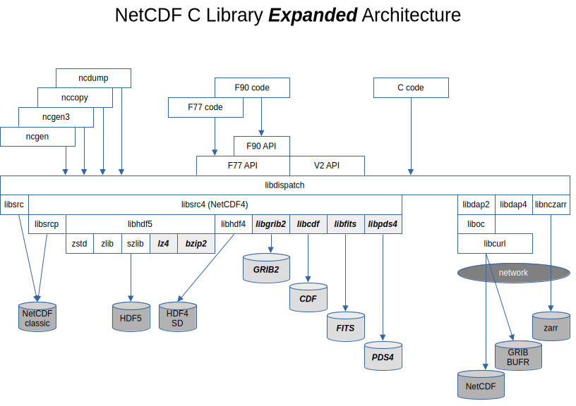

# The NetCDF Expansion Pack (NEP) - Extending the Capabilities of NetCDF

Edward Hartnett, Intelligent Data Design
2026-07-17

# Abstract

The NetCDF Expansion Pack (NEP) extends the netCDF-4 scientific-data library with additional lossless compression filters and read-only User Defined Format (UDF) handlers for common scientific binary formats. NEP uses two existing extension points in netCDF-C: HDF5 filter plugins for per-variable compression, and the NC_Dispatch layer for format-specific readers. The package adds LZ4 compression for speed-critical workflows and BZIP2 compression for archival storage; both are exposed through the standard `nc_def_var_*` API and loaded transparently by HDF5 at runtime. For multi-format access, NEP registers UDF dispatch tables that map GeoTIFF, GRIB2, FITS, NASA CDF, and NASA/ESA PDS4 files into the netCDF in-memory model. Existing netCDF applications can open these files with `nc_open()` and read them with `nc_get_vara()` without modification or recompilation. Native metadata are translated to netCDF attributes, preferably following the CF convention. NEP also includes C and Fortran example programs and performance benchmarks. It builds with CMake or Autotools, installs through Spack or Conda, and is released as open source.

# Introduction

The netCDF C library (netcdf-c) has become the basis for many scientific and operational workflows. The netcdf-c library is maintained at NSF Unidata/UCAR and is free and open source.

The NetCDF Expansion Pack (NEP) expands the capabilities of the netCDF C library by adding:
* compression filters LZ4 and BZIP2.
* format readers for GeoTIFF, GRIB2, FITS, NASA CDF, and NASA/ESA PDS4 files
* a complete set of netCDF C/Fortran example programs, demonstrating netCDF features like remote access, compression with quantization, and ncZarr cloud access.

The NEP is free and open source, maintained by the author at Intelligent Data Design, Inc.

The current version of the NetCDF Expansion Pack is 2.7.1 (July, 2026). It requires the most recently released netcdf-c (4.10.1) and any recent netcdf-fortran.

The NEP supports CMake and autotools builds, and provides Spack and Conda builds for user convenience. Complete and up-to-date instructions for building from source can be found in the README.

# Compression

The high data volumes of modern instruments and models present an ever-increasing challenge for researchers.

Recent improvements to compression in the netcdf-c library include support for Zstandard, and lossy compression with the quantize feature. The NEP provides two additional lossless HDF5 filter plugins: LZ4 and BZIP2. Both are exposed through a standard `nc_def_var_*` API and require chunked variables; HDF5 loads them automatically when `HDF5_PLUGIN_PATH` points to the NEP plugin directory.

## LZ4 - Faster than Zstd

LZ4 is a lossless compression algorithm from the LZ77 family that trades maximum compression ratio for very high throughput. NEP exposes it via `nc_def_var_lz4(ncid, varid, level)` and `nc_inq_var_lz4()`, with Fortran equivalents `nf90_def_var_lz4` and `nf90_inq_var_lz4`. Levels range from 1 to 9, with level 1 fastest and level 9 most compact.

For best results on multi-byte data, the shuffle filter should be enabled separately with `nc_def_var_deflate(ncid, varid, 1, 0, 0)` before calling `nc_def_var_lz4()`. This reorders bytes so that the most-significant bytes of adjacent values are compressed together, typically improving the compression ratio for slowly varying floating-point data.

## BZIP2 - Slow but Compressive

BZIP2 uses the Burrows-Wheeler block-sorting algorithm to achieve higher compression ratios than LZ4, Zstandard, or ZLIB, but at the cost of much lower compression speed. NEP exposes it via `nc_def_var_bzip2(ncid, varid, level)` and `nc_inq_var_bzip2()`, with Fortran equivalents `nf90_def_var_bzip2` and `nf90_inq_var_bzip2`. Levels range from 1 to 9 and control the block size; decompression speed is largely independent of the level.

As with LZ4, the shuffle filter is enabled separately before calling `nc_def_var_bzip2()`. BZIP2 is most useful for long-term archives or data that are written once and read rarely, where storage size matters more than access speed.

## Compression Performance

The following table compares write time, read time, file size, and compression ratio on a 150 MB NetCDF-4 float dataset.

| Method | Write Time (s) | File Size (MB) | Read Time (s) | Compression Ratio | Write Speed | Read Speed |
|---|---|---|---|---|---|---|
| none | 0.27 | 150.01 | 0.14 | 1.0× | 1.0× | 1.0× |
| lz4 | 0.34 | 68.95 | 0.16 | 2.2× | 0.79× | 0.88× |
| zstd | 0.66 | 34.94 | 0.26 | 4.3× | 0.41× | 0.54× |
| zlib | 1.83 | 41.78 | 0.59 | 3.6× | 0.15× | 0.24× |
| bzip2 | 22.14 | 22.39 | 5.90 | 6.7× | 0.01× | 0.02× |

LZ4 adds minimal overhead while roughly halving file size; Zstandard (now in netCDF-C) offers a strong ratio-speed balance; BZIP2 yields the highest compression ratio but is an order of magnitude slower and is therefore best suited to archival use.

# Reading Other Formats with Existing NetCDF Applications

The netcdf-c library supports several binary formats:
* CDF1/2/5 (a.k.a. classic formats)
* HDF5 (a.k.a. NetCDF-4)
* Zarr (a.k.a. ncZarr)
* OPeNDAP DAP2/4
* HDF4 (optionally)

All of these binary formats are read and written with the same simple C API (with Fortran wrappers). This is accomplished with a C struct holding pointers to functions - each binary format gets its own set of function pointers for each critical netCDF function. This is known as the dispatch layer in NetCDF documentation.

The dispatch layer is exposed to advanced users with the nc_def_user_format() function, which can be used to add a new binary format to those already known to netCDF.

The NetCDF Expansion Pack uses this feature to provide netCDF readers for several additional common formats. With these readers, files of the specified format appear to be netCDF files, to all netCDF codes and applications. (No code changes, not even relinking required).

In all cases the native metadata is converted to netCDF attributes, preferably attributes compliant with the CF convention.

## Using the netcdf-c Dispatch Layer

The dispatch layer is built around an `NC_Dispatch` structure that holds one function pointer for each netCDF API entry point. When `nc_open()` reads a file, netCDF-C compares the file's leading bytes against the magic numbers registered for each UDF slot and then uses the matching dispatch table for all subsequent calls. Functions that are meaningful for the format are implemented—open, close, variable inquiry, `nc_get_vara`, attribute inquiry, and dimension inquiry—while operations that do not make sense are replaced by stub functions such as `NC_RO_def_var` or `NC_RO_put_att`, which return an error because NEP's handlers are read-only.



A NEP handler registers itself by filling an `NC_Dispatch` table and calling `nc_def_user_format()`. For example, the NASA CDF handler contains:

```c
#include "nep.h"
#include "cdfdispatch.h"

static const NC_Dispatch CDF_dispatcher = {
    NC_FORMATX_NC_CDF,
    NC_DISPATCH_VERSION,
    NC_RO_create,      /* read-only: no create */
    NC_CDF_open,
    NC_RO_redef,       /* read-only */
    ...
    NC_CDF_get_vara,
    NC_RO_put_vara,    /* read-only */
    ...
};
```

This dispatch layer causes NC_RO_create() to be called when the user attempts to create a file in NASA CDF format. This will fail, as the CDF format reader is read-only. A call to nc_open() on a CDF file will call NC_CDF_open(), which uses the NASA CDF library to open the file, and then sets up internal netCDF metadata for the file, allowing other netCDF functions to work. The combination of internal metadata and custom functions such as NC_CDF_open allow the netcdf-c library to read CDF files as if they were netCDF.

The dispatch layer has to be initialized before attempting to open a CDF file. This can be done explicitly with a call to nc_def_user_format(), or it can be done with the .ncrc file.

```c
int NC_CDF_initialize(void) {
    return nc_def_user_format(NEP_UDF_CDF, &CDF_dispatcher, NEP_MAGIC_CDF);
}
```

Once `NC_CDF_initialize()` (or the equivalent `.ncrc` autoload entry) has run, any later `nc_open()` call on a CDF file routes through this dispatch table instead of the native netCDF-4 reader.

## Initialization File .ncrc

NetCDF-C supports a run-time configuration file named `.ncrc` that can set defaults and register User Defined Format (UDF) handlers automatically. When `nc_open()` encounters a file whose magic number matches a UDF entry, netCDF-C loads the specified shared library and calls the registered initializer, then dispatches the file to that handler.

The `.ncrc` file is searched for in the user's home directory (`~/.ncrc`) or in the directory pointed to by the `NETCDF_RC` environment variable. `NETCDF_RC` must be set to a directory containing the `.ncrc` file, not to the file itself. NEP's build systems generate a `.ncrc` in the build tree with the library paths needed for each enabled UDF handler; the Autotools build also generates `.ncrc-install` with install-path library locations.

Each UDF handler is registered in `.ncrc` with three entries per slot: `NETCDF.UDFx.MAGIC`, `NETCDF.UDFx.LIBRARY`, and `NETCDF.UDFx.INIT`, where `x` is the UDF slot number and `INIT` names the handler's initialize function (for example, `NC_GRIB2_initialize`). 

If an initialization file is not used, the same initialize functions can be called explicitly before `nc_open()`.

For example, a `/home/ed/.ncrc` file that enables all NEP UDF handlers would contain:

```ini
NETCDF.UDF0.LIBRARY=/usr/local/lib/libncgeotiff.so
NETCDF.UDF0.INIT=NC_GEOTIFF_initialize
NETCDF.UDF0.MAGIC=II+

NETCDF.UDF1.LIBRARY=/usr/local/lib/libncgeotiff.so
NETCDF.UDF1.INIT=NC_GEOTIFF_initialize
NETCDF.UDF1.MAGIC=II*

NETCDF.UDF2.LIBRARY=/usr/local/lib/libncgrib2.so
NETCDF.UDF2.INIT=NC_GRIB2_initialize
NETCDF.UDF2.MAGIC=GRIB

NETCDF.UDF3.LIBRARY=/usr/local/lib/libncfits.so
NETCDF.UDF3.INIT=NC_FITS_initialize
NETCDF.UDF3.MAGIC=SIMPLE

NETCDF.UDF4.LIBRARY=/usr/local/lib/libnccdf.so
NETCDF.UDF4.INIT=NC_CDF_initialize
NETCDF.UDF4.MAGIC=\xCD\xF3\x00\x01

NETCDF.UDF5.LIBRARY=/usr/local/lib/libncpds4.so
NETCDF.UDF5.INIT=NC_PDS4_initialize
NETCDF.UDF5.MAGIC=<?xml
```

With this file in place and `NETCDF_RC=/home/ed` exported, `nc_open()` will autoload the appropriate handler based on the file's leading magic bytes.

## GRIB2

GRIB2 is the WMO standard for gridded data. It is a complex format which consists of coded messages, each with its own decoding, identified by a myriad of integer codes. Tables of codes are required to be maintained with quarterly releases from the WMO. The situation may be confused by the use of local or temporary codes, undocumented at the WMO level but required to understand the data.

To read GRIB2 files the NEP uses the g2c library from NOAA. The g2c library is a C library used by NOAA to code and decode GRIB2 messages.

Each GRIB2 product maps to a separate `NC_FLOAT` netCDF variable. All variables in a file share the same `y` and `x` dimensions, whose sizes are taken from the first product. Variable names come from the GRIB2 parameter abbreviation, with duplicates disambiguated by `_2`, `_3`, and so on.

Variable attributes record the GRIB2 discipline, category, and parameter number, and a `_FillValue` marks missing grid points. Global attributes identify the file as GRIB2 edition 2. Data are read by expanding each GRIB2 message into a full grid; bitmap-masked points are replaced with `_FillValue`, and `start`/`count` slices select the requested region.

## GeoTIFF

The GeoTIFF UDF handler reads standard TIFF and BigTIFF files through libgeotiff and libtiff. Image bands, rows, and columns map to netCDF dimensions; raster data are exposed as netCDF variables. Georeferencing information is converted to CF-1.8 `grid_mapping` attributes. The handler is read-only.

A single-band raster maps to a 2D netCDF variable `[y, x]`, while a multi-band raster maps to a 3D variable `[band, y, x]`. Coordinate variables are built from the GeoTransform tags: geographic CRS files get `lon[x]` and `lat[y]`, and projected CRS files get `x[x]` and `y[y]`. For pixel-as-area rasters, bounds variables are also created.

The CF-1.8 `crs` grid-mapping variable stores projection parameters such as `grid_mapping_name`, `semi_major_axis`, and `inverse_flattening`. The data variable carries `grid_mapping` and `coordinates` attributes linking it to the CRS and coordinate variables. If the GeoTIFF lacks usable CRS tags, the raster data remain accessible without a `crs` variable.

## NASA CDF

The CDF UDF handler uses the NASA CDF library. CDF zVariables and attributes map to netCDF variables and attributes; `FILLVAL` becomes `_FillValue`. CDF data types are translated to the closest netCDF types. rVariables are not supported; write access is not implemented.

CDF zVariables map directly to netCDF variables, with CDF data types translated to the closest netCDF types and variable shapes taken from the CDF variable dimensions. CDF attributes become netCDF attributes; the CDF `FILLVAL` attribute is renamed to the CF-standard `_FillValue`.

Only zVariables are exposed; rVariables are not supported, and all access is read-only. The handler opens CDF files with the NASA CDF library and reads variable data through the standard `nc_get_vara()` interface.

## FITS

The FITS UDF handler uses CFITSIO. Each Header Data Unit maps to a netCDF group: the primary HDU to the root group, and extension HDUs to child groups. Images become variables, and table columns become variables named from `TTYPEn`. Header keywords become group-level string attributes, with standard mappings such as `BUNIT` to `units` and `BLANK` to `_FillValue`. Read-only.

The primary HDU image maps to a netCDF variable named `image` in the root group; binary and ASCII table HDUs expose each column as a separate variable named from `TTYPEn`. Table row count becomes the record dimension, and vector columns map to 2D variables. FITS `TUNITn` values become `units` attributes.

FITS header keywords are preserved as group-level string attributes. Standard keywords are mapped to netCDF/CF equivalents: `BUNIT` to `units`, `BSCALE` to `scale_factor`, `BZERO` to `add_offset`, and `BLANK` to `_FillValue`. The FITS axis order is reversed so that the netCDF variable uses C-style row-major indexing.

## NASA/ESA PDS4

The PDS4 UDF handler parses XML label files with libxml2 and reads the associated binary or ASCII data files. Array objects become netCDF variables with dimensions from `Axis_Array` elements; tables become variables with a `record` dimension. `Identification_Area` and `Observation_Area` metadata become global attributes. Read-only.

Each `File_Area_Observational` in the PDS4 label becomes a netCDF child group named from the data file. Array objects map to netCDF variables with dimensions derived from the label's `Axis_Array` entries; `axis_name` gives the dimension name and `elements` gives its length. Variable types are taken from `Element_Array/data_type`, and `scaling_factor`/`value_offset` are preserved as string attributes when present.

Table objects map to variables over a `record` dimension sized by the table's `<records>` element; each `Field_*` becomes a variable named from its `<name>`, with type from `<data_type>` and optional `units` from `<unit>`. Repeated fields in `Group_Field_Binary` introduce additional trailing dimensions. Global attributes capture `Identification_Area` and `Observation_Area` metadata.

The following real mission datasets have been used to validate the PDS4 reader:

| Mission | Data Description | Test Notes |
|---|---|---|
| Cassini-Huygens | HRD dust-detector engineering on/off log | `Table_Character` in `.tab`; verifies 11 records and two `NC_CHAR` fields |
| MESSENGER | Mercury thermal-neutron map | `Array_2D_Map` in `.img`; verifies 360×720 `NC_UBYTE` array and hyperslab reads |
| Deep Impact | Comet 9P/Tempel photometry table | `Table_Character` in `.tab`; verifies 8 `ASCII_Integer`/`ASCII_Real` variables and first-record values |
| MAVEN | NGIMS L1B housekeeping (324 fields) and L3 science (15 fields) tables; IUVS L2 corona and periapse FITS-backed tables | Exercises `Table_Delimited`, `Table_Binary` with `Group_Field_Binary` depth-1 and depth-2 nested groups |
| Mars 2020 / Perseverance | Mastcam-Z Sol 1737/1738 calibrated radiance images | `Array_3D_Image` in VICAR/ODL `.IMG`; verifies `NC_SHORT` `[3,1200,1648]` arrays and `SignedMSB2` pixel values |
| New Horizons | Alice ultraviolet spectrograph histogram/PHD/housekeeping products | `.lblx` labels with `.fit` containers; exercises `Array_2D_Spectrum`, `Array_1D`, and `Table_Binary` |

# NetCDF Example Programs

NEP includes C and Fortran examples for classic netCDF, NetCDF-4, NcZarr, OPeNDAP, and parallel I/O. These programs are companion code for *The NetCDF Developer's Handbook: The Authoritative Guide to Writing High-Performance Programs for Scientific Data Management, Second Edition* — available on [Amazon](https://www.amazon.com/dp/B0H7Q1Z75L). Performance benchmarks compare compression filters, chunking strategies, and cache tuning. All examples build and run as tests.

## Classic NetCDF Examples

| Example | C File | Fortran File | Description |
|---|---|---|---|
| Simple 2D Array | `simple_2D.c` | `f_simple_2D.f90` | Creates and writes a basic 2D array. |
| Coordinate Variables | `coord_vars.c` | `f_coord_vars.f90` | Defines and uses coordinate variables. |
| Format Variants | `format_variants.c` | `f_format_variants.f90` | Demonstrates classic, 64-bit offset, and CDF-5 formats. |
| Size Limits | `size_limits.c` | `f_size_limits.f90` | Shows size and dimension limits. |
| Unlimited Dimension | `unlimited_dim.c` | `f_unlimited_dim.f90` | Uses an unlimited dimension for time series. |
| 4D Variable | `var4d.c` | `f_var4d.f90` | Creates and writes a 4D variable. |
| Quickstart | `quickstart.c` | `f_quickstart.f90` | Minimal getting-started example. |
| Dump Metadata | `dump_classic_metadata.c` | `f_dump_classic_metadata.f90` | Prints classic-file metadata. |

## NetCDF-4 Examples

| Example | C File | Fortran File | Description |
|---|---|---|---|
| Simple NetCDF-4 | `simple_nc4.c` | `f_simple_nc4.f90` | Basic NetCDF-4 file creation. |
| Compression | `compression.c` | `f_compression.f90` | Deflate and shuffle compression. |
| Chunking Performance | `chunking_performance.c` | `f_chunking_performance.f90` | Chunk shape selection and performance. |
| Multiple Unlimited Dims | `multi_unlimited.c` | `f_multi_unlimited.f90` | Multiple unlimited dimensions. |
| User-defined Types | `user_types.c` | `f_user_types.f90` | Compound and enum types. |
| Groups | `groups.c` | `f_groups.f90` | NetCDF-4 hierarchical groups. |
| Format Variants | `format_variants.c` | `f_format_variants.f90` | NetCDF-4 format variants. |
| Dump Metadata | `dump_nc4_metadata.c` | `f_dump_nc4_metadata.f90` | Prints NetCDF-4 metadata. |

## NcZarr Examples

| Example | C File | Fortran File | Description |
|---|---|---|---|
| Simple NcZarr | `nczarr_simple.c` | `f_nczarr_simple.f90` | Create, write, and read a local NcZarr dataset. |
| Chunking | `nczarr_chunking.c` | `f_nczarr_chunking.f90` | Explicit chunk shape selection. |
| Compression | `nczarr_compression.c` | `f_nczarr_compression.f90` | Deflate + shuffle on a chunked variable. |
| Enhanced Model | `nczarr_enhanced.c` | `f_nczarr_enhanced.f90` | Groups and unlimited dimensions in NcZarr. |

## OPeNDAP Examples

| Example | C File | Fortran File | Description |
|---|---|---|---|
| Simple OPeNDAP | `opendap_simple.c` | `f_opendap_simple.f90` | Basic remote data access. |
| Subsetting | `opendap_subset.c` | `f_opendap_subset.f90` | Reading a subset of a remote dataset. |
| Constraint Expression | `opendap_constraint.c` | `f_opendap_constraint.f90` | Using constraint expressions. |

## Parallel I/O Examples

| Example | C File | Fortran File | Description |
|---|---|---|---|
| Square 16 Parallel | `square16_par.c` | `f_square16_par.f90` | Collective parallel write/read with MPI. |

## Performance Benchmarks

| Example | C File | Description |
|---|---|---|
| Cache Tuning | `cache_tuning.c` | HDF5 chunk cache configuration. |
| Chunking | `chunking.c` | Chunk shape effects on read patterns. |
| Deflate | `deflate.c` | zlib levels 0–9 with/without shuffle. |
| Fill Values | `fill_values.c` | Fill mode ON vs OFF overhead. |
| Endianness | `endianness.c` | Byte-order performance effects. |
| Lossless Comparison | `lossless.c` | Compare available lossless filters. |
| Quantize + Compress | `quantize.c` | Quantization paired with compression. |
| Zstandard | `zstandard.c` | Zstandard level sweep. |
| SZIP | `szip.c` | SZIP coding method sweep. |
| LZ4 | `lz4.c` | LZ4 level sweep. |
| BZIP2 | `bzip2.c` | BZIP2 level sweep. |

# Future Plans

Future work includes additional UDF format readers, extended GRIB2 support for time, level, and ensemble dimensions, and continued alignment with NetCDF-C and HDF5 releases.

# Summary

NEP extends netCDF-4 with:
* High-speed and high-ratio compression filters
* Transparent read access to major scientific data formats (without requiring changes to existing netCDF applications)
* Comprehensive netCDF example programs in C/Fortran, demonstrating advanced lossy and lossless compression, ncZarr cloud format, and OPeNDAP remote data access.

# References

- Hartnett, E. *The NetCDF Developer's Handbook: The Authoritative Guide to Writing High-Performance Programs for Scientific Data Management, Second Edition*. Intelligent Data Design, 2026. https://www.amazon.com/dp/B0H7Q1Z75L
- Unidata/UCAR. *NetCDF-C*. https://www.unidata.ucar.edu/software/netcdf/
- Eaton, B., et al. *CF Metadata Conventions*. http://cfconventions.org/
- HDF Group. *HDF5 Filter Plugins*. https://support.hdfgroup.org/HDF5/doc/Advanced/DynamicallyLoadedFilters/
