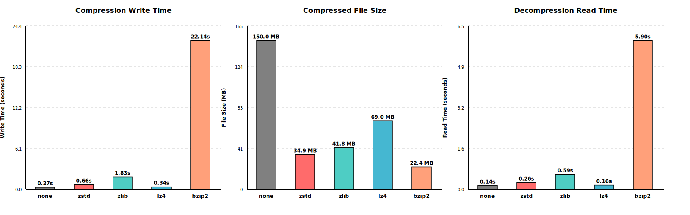

# NEP Compression Filters

NEP provides two lossless HDF5 filter plugins that integrate transparently with NetCDF-4 applications. Both are enabled by default.

## LZ4

LZ4 is a lossless compression algorithm from the LZ77 family, focused on speed rather than maximum compression ratio.

**Key Features:**
- 2-3x faster compression/decompression than DEFLATE
- Lossless — guarantees data integrity
- Designed for speed-critical HPC workflows
- Works seamlessly with existing NetCDF-4 applications

**Performance Characteristics:**
- Compression speed: several times faster than DEFLATE
- Decompression speed: significantly faster than DEFLATE
- Compression ratio: good trade-off between speed and size reduction
- Use case: I/O-bound scientific workflows where speed matters more than maximum compression

**C API:**
```c
nc_def_var_lz4(ncid, varid, level);
nc_inq_var_lz4(ncid, varid, &hasfilter, &level);
```

**Fortran API:**
```fortran
nf90_def_var_lz4(ncid, varid, level)
nf90_inq_var_lz4(ncid, varid, hasfilter, level)
```

## BZIP2

BZIP2 uses the Burrows-Wheeler block sorting algorithm to achieve high compression ratios, making it ideal for archival storage.

**Key Features:**
- Superior compression ratios — better than DEFLATE and significantly better than LZ4
- Lossless — guarantees data integrity
- Block-sorting algorithm especially effective on repetitive scientific data patterns
- Works seamlessly with existing NetCDF-4 applications

**Performance Characteristics:**
- Compression ratio: exceeds DEFLATE, ideal for storage optimization
- Compression speed: slower than LZ4 but faster than most high-ratio algorithms
- Decompression speed: moderate, suitable for archival workflows
- Use case: long-term archival, bandwidth-constrained transfers, storage-limited environments

**C API:**
```c
nc_def_var_bzip2(ncid, varid, level);
nc_inq_var_bzip2(ncid, varid, &hasfilter, &level);
```

**Fortran API:**
```fortran
nf90_def_var_bzip2(ncid, varid, level)
nf90_inq_var_bzip2(ncid, varid, hasfilter, level)
```

## Choosing the Right Algorithm

- **Use LZ4 when**: I/O speed is critical, working with real-time data, running on HPC systems, need fast decompression
- **Use BZIP2 when**: Storage space is limited, archiving data long-term, transferring over slow networks, compression ratio matters most

## Setup

Set `HDF5_PLUGIN_PATH` to the NEP plugin directory before running your application:

```bash
export HDF5_PLUGIN_PATH=/usr/local/lib/plugin
```

HDF5 then loads the appropriate filter automatically on open or create.

## Performance Comparison

The following benchmarks compare compression methods on a 150 MB NetCDF-4 dataset. The programs used to generate these results are in `examples/performance/`.

### All Compression Methods



### Fast Compression Methods (Excluding BZIP2)

For better visualization of the faster compression methods:


| Method | Write Time (s) | File Size (MB) | Read Time (s) | Compression Ratio | Write Speed | Read Speed |
|--------|----------------|----------------|---------------|-------------------|-------------|------------|
| none   | 0.27           | 150.01         | 0.14          | 1.0×              | 1.0×        | 1.0×       |
| lz4    | 0.34           | 68.95          | 0.16          | 2.2×              | 0.79×       | 0.88×      |
| zstd   | 0.66           | 34.94          | 0.26          | 4.3×              | 0.41×       | 0.54×      |
| zlib   | 1.83           | 41.78          | 0.59          | 3.6×              | 0.15×       | 0.24×      |
| bzip2  | 22.14          | 22.39          | 5.90          | 6.7×              | 0.01×       | 0.02×      |

**Key Insights:**
- **LZ4** offers the best balance: 2.2× compression with minimal performance impact (79% write speed, 88% read speed)
- **ZSTD** (recently added to NetCDF) provides excellent compression (4.3×) with moderate performance impact (41% write speed, 54% read speed)
- **ZLIB** (standard DEFLATE) shows 3.6× compression but is slower than both LZ4 and ZSTD
- **BZIP2** achieves the highest compression ratio (6.7×) but is significantly slower (1% write speed, 2% read speed)
- **Read performance** generally mirrors write performance, with LZ4 being fastest and BZIP2 being slowest

## Build Options

- **CMake**: `-DBUILD_LZ4=ON/OFF` (default: `ON`), `-DBUILD_BZIP2=ON/OFF` (default: `ON`)
- **Autotools**: `--enable-lz4` / `--disable-lz4`, `--enable-bzip2` / `--disable-bzip2`

See `docs/build-options.md` for the full build option reference.
