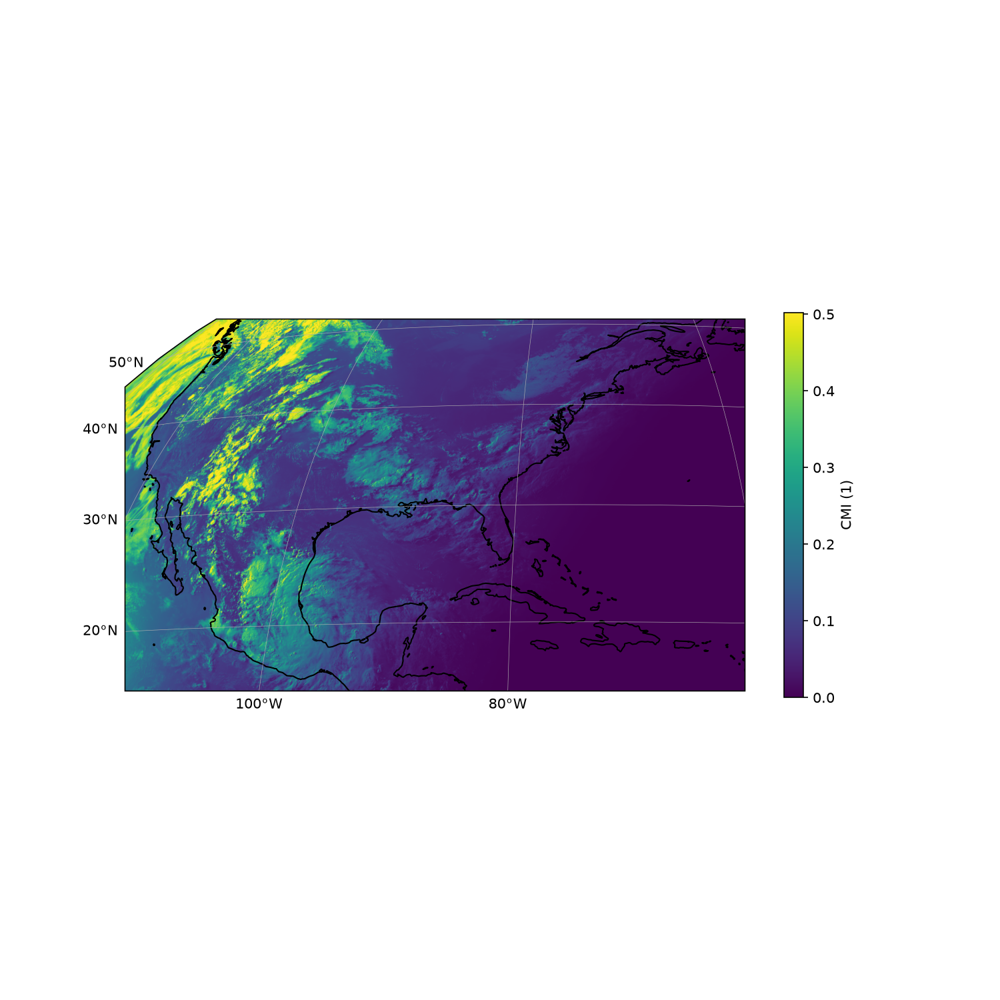
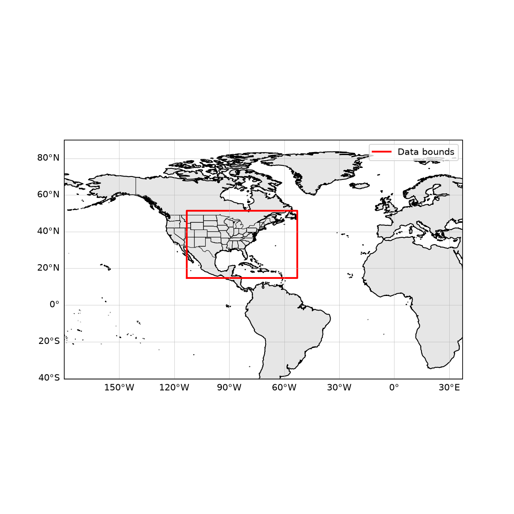

# GOES-R ABI Cloud and Moisture Imagery Example

A standalone Python example that opens a GOES-R Advanced Baseline Imager
(ABI) Level 2 Cloud and Moisture Imagery (CMIP) NetCDF and plots it on the
native geostationary projection. It mirrors the `examples/nisar/` and
`examples/swot/` structure and uses the same tools: `xarray`, `netCDF4`,
`matplotlib`, `cartopy`, and `boto3`.

This example is **not** built or tested by NEP's CMake/CTest suite; it is
a plain, standalone Python script demonstrating how to open a
CF/netCDF-compliant science file and visualize it. It does not exercise
any NEP UDF format reader — ABI CMIP files are already
netCDF-4-compatible, so they open directly with `xarray`/`netCDF4`.

## GOES-R ABI CMIP Data

The GOES-R series (GOES-16/17/18/19, also called GOES-East and
GOES-West) are NOAA geostationary weather satellites at approximately
35,786 km altitude. Each carries the Advanced Baseline Imager (ABI), a
16-channel geostationary imager, plus instruments for lightning mapping,
solar monitoring, and space weather. The Level 2 Cloud and Moisture
Imagery Product (CMIP) provides single-channel, rectified, geolocated
imagery on the ABI fixed grid (`x` and `y` radian angles from the
satellite sub-point). CMIP files are CF-1.7 compliant NetCDF-4.

Three sector products are produced:

* `ABI-L2-CMIPF` — Full Disk
* `ABI-L2-CMIPC` — CONUS (Contiguous U.S.)
* `ABI-L2-CMIPM1` / `ABI-L2-CMIPM2` — Mesoscale sectors 1 and 2

See `docs/netCDF_with_ABI_CMIP.md` for a
fuller description of the GOES-R spacecraft, ABI channels, the other
GOES-R instruments, ground data processing, and the family of ABI-derived
Level 2 products.

ABI CMIP files are available from the public NOAA GOES AWS Open Data
registry (`noaa-goes16`, `noaa-goes17`, `noaa-goes18`, `noaa-goes19`).
They are **not** bundled with this repository; you must provide a path to a
local `.nc` file, or use the `--date` fetch flags to download one.

> **Note:** ABI-like imagers also fly on EUMETSAT/MTG (Flexible
> Combined Imager), the Korea Meteorological Administration GEO-KOMPSAT
> (Advanced Meteorological Imager), and JAXA Himawari (Advanced Himawari
> Imager). This example targets the NOAA GOES-R ABI product format.

## Setup

Requires Python >= 3.9. Create a virtual environment and install the
example's dependencies:

```bash
python3 -m venv .venv
.venv/bin/pip install -r examples/abi/requirements.txt
```

This installs `xarray`, `netCDF4`, `matplotlib`, `cartopy`, and `boto3`.

## Running the Example

From the `examples/abi/` directory, run the `abi_example` package against a
local CMIP `.nc` file:

```bash
.venv/bin/python -m abi_example /path/to/OR_ABI-L2-CMIPC-...
```

Two PNGs are written to `output/` (untracked): `cmi_map.png` and
`footprint.png`.

Useful flags:

```bash
.venv/bin/python -m abi_example FILE --show             # also display interactively
.venv/bin/python -m abi_example FILE --output-dir figs  # custom output directory
```

### Fetching Data for a Date and Sector

Instead of a local file, you can ask the tool to fetch the closest
matching GOES-R ABI CMIP granule from the NOAA AWS Open Data registry. You
need only outbound HTTPS access to AWS; no Earthdata Login is required.

```bash
.venv/bin/python -m abi_example \
    --date 2024-07-01T00:00 \
    --satellite GOES-16 \
    --channel 01 \
    --region C
```

Flags:

* `--date` — target UTC date/time, e.g. `2024-07-01T00:00`.
* `--satellite` — `GOES-16`, `GOES-17`, `GOES-18`, `GOES-19`, or
  `east`/`west` aliases.
* `--channel` — ABI channel `01`–`16` (default `01`).
* `--region` — `F` (Full Disk), `C` (CONUS), `M1` or `M2` (Mesoscale,
  default `F`).

The downloaded file is cached in `data/` (untracked) and reused on later
runs.

## Example Output

The sample images below were produced from
`OR_ABI-L2-CMIPC-M6C01_G16_s20241830001180_e20241830003553_c20241830004036.nc`
— a GOES-16 CONUS channel 01 (blue visible, 0.47 µm) granule from
2024-07-01 00:01 UTC.



*GOES-16 ABI channel 01 reflectance (dimensionless) over the CONUS
sector, plotted on the native geostationary projection with coastlines
and a lat/lon grid.  The rectangular ABI fixed grid appears slightly
curved in geographic coordinates because the projection is viewed from
geostationary orbit.  Pixels flagged by `DQF` are masked transparent.*



*Footprint overview: the CONUS sector's lat/lon bounding box (red) plotted
on a padded regional map with coastlines and political boundaries.*

## Package Layout

* `abi_example/reader.py` — opens the ABI CMIP NetCDF, loads `CMI`,
  applies any `DQF` mask, and attaches the 1-D `x`/`y` radian-angle
  coordinates and `goes_imager_projection` metadata.
* `abi_example/plots.py` — `cartopy`/`matplotlib` plotting helpers for the
  geostationary CMI map and the lat/lon footprint overview.
* `abi_example/fetch.py` — lists and downloads from the public NOAA GOES
  AWS Open Data buckets, used by `--date`.
* `abi_example/cli.py` — command-line entry point (`python -m abi_example`).
