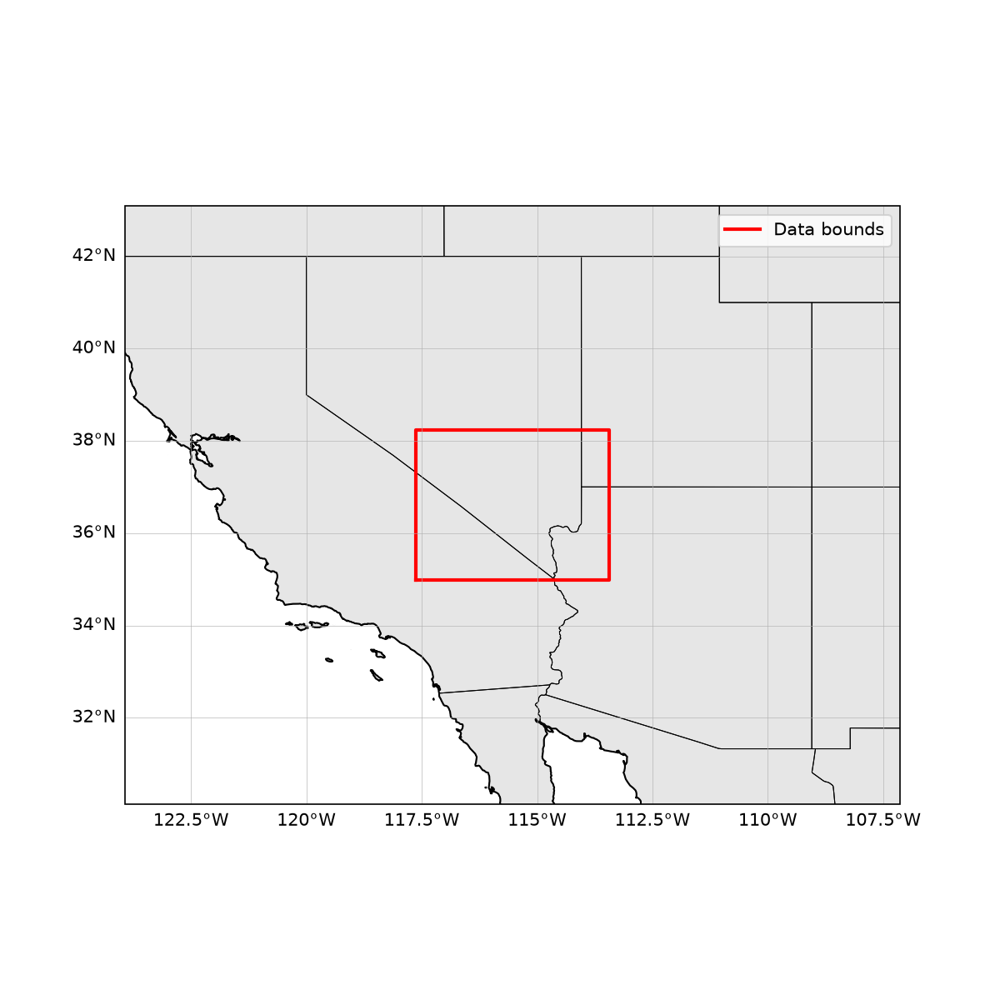

# NISAR Soil Moisture Example

A standalone Python example that opens a NISAR (NASA-ISRO SAR) Level 3
Soil Moisture (SME2) product and plots it. Ported from the
[`nisar_play`](https://captainkirk99.github.io/nisar_play/) exploration
project.

This example is **not** built or tested by NEP's CMake/CTest suite; it is
a plain, standalone Python script demonstrating how to open a
CF/netCDF-compliant HDF5 science file and visualize it. It does not
exercise any NEP UDF format reader — SME2 files are already
netCDF4-compatible HDF5, so they open directly with `xarray`/`netCDF4`.

## NISAR SME2 Data

The [SME2](https://nisar-docs.asf.alaska.edu/sme2) product provides global
soil moisture estimates at 200 m pixel spacing (500 m over the Sahara). See
the [NISAR Data User Guide](https://nisar-docs.asf.alaska.edu/) for full
documentation.

NISAR SME2 files are large (100+ MB) and are **not** bundled with this
repository. You must provide a path to a local `.h5` file, or use `--bbox`
to search and download one from NASA Earthdata.

> **Note:** each SME2 granule download includes a small companion
> `..._QA_STATS.h5` file (summary statistics only, no `/science` group).
> Point this example at the main product file (no `_QA_STATS` suffix) —
> the companion file will fail to open with a "group not found: science"
> error.

## Setup

Requires Python >= 3.9. Create a virtual environment and install the
example's dependencies:

```bash
python3 -m venv .venv
.venv/bin/pip install -r examples/nisar/requirements.txt
```

This installs `xarray`, `netCDF4`, `matplotlib`, `cartopy`, and
`earthaccess`.

## Running the Example

From the `examples/nisar/` directory, run the `nisar_example` package
against a local SME2 file:

```bash
.venv/bin/python -m nisar_example /path/to/NISAR_L3_..._SME2_....h5
```

Two PNGs are written to `output/` (untracked): `soil_moisture.png` and a
`footprint.png` overview map showing the granule's lat/lon bounds.

Useful flags:

```bash
.venv/bin/python -m nisar_example FILE --show             # also display interactively
.venv/bin/python -m nisar_example FILE --output-dir figs  # custom output directory
```

### Fetching Data for a Lat/Lon Box

Instead of a local file, a lat/lon bounding box (west, south, east, north,
in degrees) can be given. The tool searches NASA Earthdata for NISAR SME2
granules whose footprint intersects the box, downloads the most recently
acquired one into `data/` (untracked), and plots it. If the granule is
already in `data/`, the download is skipped.

```bash
.venv/bin/python -m nisar_example --bbox -117.6 35 -113.4 38
```

Downloading requires a free
[NASA Earthdata Login](https://urs.earthdata.nasa.gov/) account.
Credentials are read from `~/.netrc` (or the
`EARTHDATA_USERNAME`/`EARTHDATA_PASSWORD` environment variables), falling
back to an interactive prompt. Example `~/.netrc` entry (set
`chmod 600 ~/.netrc`):

```
machine urs.earthdata.nasa.gov
    login YOUR_USERNAME
    password YOUR_PASSWORD
```

## Example Output


*Soil moisture (m³/m³) from a sample SME2 granule over southern
Nevada/California, drawn on a cartopy map with state borders and
gridlines. Only recommended retrievals are shown: fill values and pixels
whose `retrievalQualityFlag` marks the retrieval "not recommended" (e.g.
urban areas, water, dense vegetation) are left blank. The tilted swath
edge reflects the satellite's orbit track on the EASE-Grid 2.0 grid.*



*Footprint overview: the granule's lat/lon bounding box (red) plotted on
a padded regional map with coastlines and state borders.*

## Package Layout

- `nisar_example/sme2.py` — reads the SME2 `grids` group and quality-masks
  the soil moisture layer using `xarray`/`netCDF4`.
- `nisar_example/plots.py` — cartopy/matplotlib plotting helpers.
- `nisar_example/fetch.py` — NASA Earthdata (CMR) search/download via
  `earthaccess`, used by `--bbox`.
- `nisar_example/cli.py` — command-line entry point (`python -m nisar_example`).
