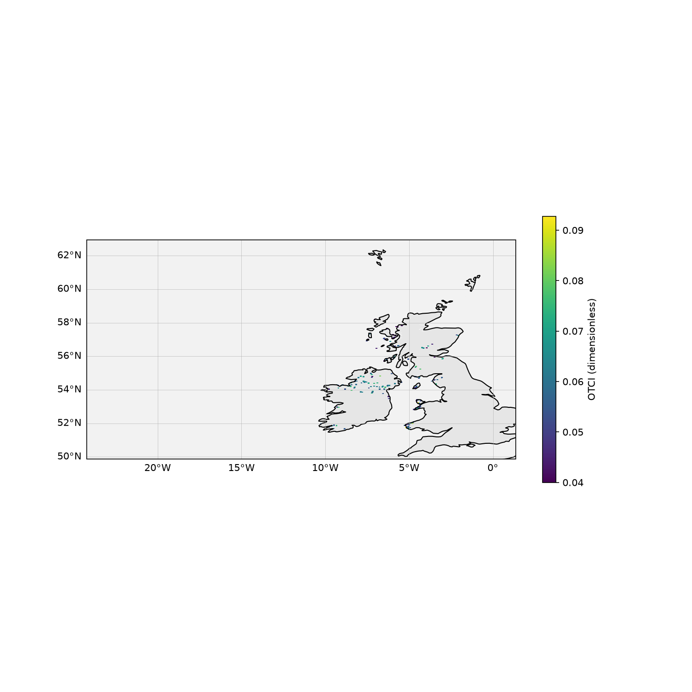
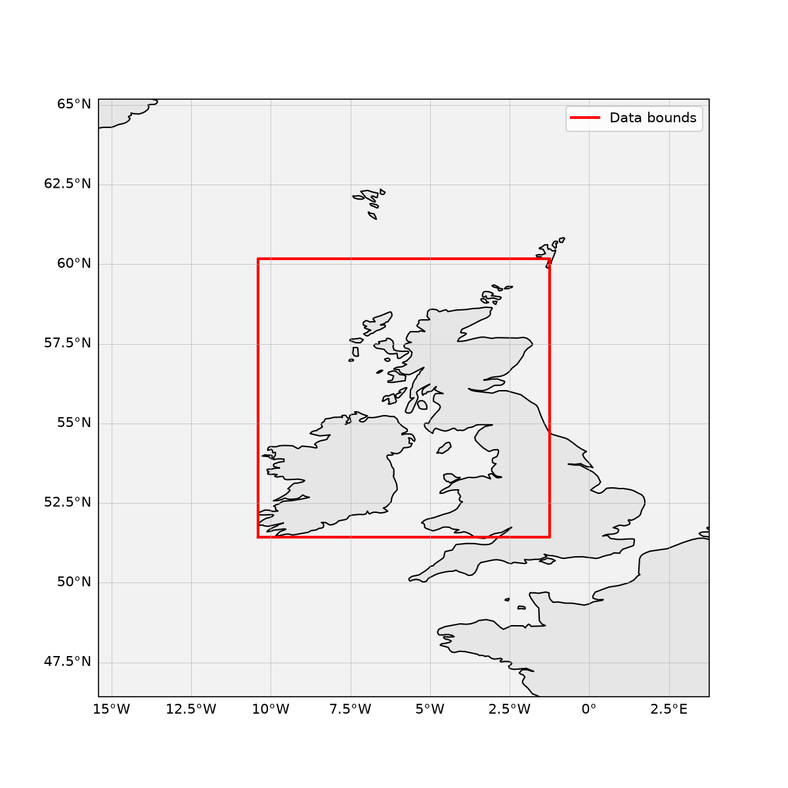

# Sentinel-3 OLCI Level-2 Land Full Resolution Example

A standalone Python example that opens a Sentinel-3A/B OLCI Level-2 Land Full
Resolution (`OL_2_LFR___`) SAFE product and plots the OLCI Terrestrial
Chlorophyll Index (OTCI) on a geographic map. It mirrors the `examples/swot/`
and `examples/abi/` structure and uses `xarray`, `netCDF4`, `matplotlib`, and
`cartopy`.

This example is **not** built or tested by NEP's CMake/CTest suite; it is a
plain, standalone Python script demonstrating how to open a CF/netCDF-compliant
science file and visualize it. It does not exercise any NEP UDF format reader
— Sentinel-3 OLCI products are already NetCDF-4-compatible, so they open
directly with `xarray`/`netCDF4`.

## Sentinel-3 OLCI Data

The Ocean and Land Colour Instrument (OLCI) is flown on ESA's Sentinel-3A
(launched 2016) and Sentinel-3B (launched 2018) satellites. The Level-2 Land
Full Resolution product (`OL_2_LFR___`) is distributed as a SAFE package
(`.SEN3` directory) containing multiple NetCDF-4 files:

* `geo_coordinates.nc` — per-pixel latitude, longitude, and altitude.
* `time_coordinates.nc` — per-row acquisition timestamps.
* `otci.nc` — OLCI Terrestrial Chlorophyll Index (`OTCI`) and uncertainty.
* `lqsf.nc` — land quality and science flags (`LQSF`).
* `gifapar.nc`, `iwv.nc`, `rc_gifapar.nc`, `instrument_data.nc`, and tie-point
  files — additional land and instrument products.

This example reads `OTCI` from `otci.nc`, applies the `LQSF` quality mask, and
plots the result on a lat/lon map using `cartopy`.

See [`docs/netCDF_with_Sentinel3_OLCI.md`](../../docs/netCDF_with_Sentinel3_OLCI.md)
for a fuller description of the mission, instrument, product families, and the
NetCDF data model.

## Setup

Requires Python >= 3.9. Create a virtual environment and install the example's
dependencies:

```bash
python3 -m venv .venv
.venv/bin/pip install -r examples/olci/requirements.txt
```

This installs `xarray`, `netCDF4`, `matplotlib`, `cartopy`, and `numpy`.

## Running the Example

From the `examples/olci/` directory, run the `olci_example` package against a
local `.SEN3` product directory:

```bash
.venv/bin/python -m olci_example /path/to/S3A_OL_2_LFR____...SEN3
```

Two PNGs are written to `output/` (untracked): `otci_map.png` and
`footprint.png`.

Useful flags:

```bash
.venv/bin/python -m olci_example /path/to/S3A_OL_2_LFR____...SEN3 --show
.venv/bin/python -m olci_example /path/to/S3A_OL_2_LFR____...SEN3 --output-dir figs
.venv/bin/python -m olci_example /path/to/S3A_OL_2_LFR____...SEN3 --stride 10
```

* `--show` — also display the figures interactively.
* `--output-dir` — custom output directory (default: `output/`).
* `--stride` — plot every N-th pixel in each dimension to speed up rendering
  (default: 10).

## Example Output

The sample images below were produced from
`S3A_OL_2_LFR____20260801T112126_20260801T112426_20260801T133209_0179_142_194_1980_PS1_O_NR_003.SEN3`
— a Sentinel-3A `OL_2_LFR___` granule from 2026-08-01 11:21 UTC.



*Sentinel-3A OLCI Terrestrial Chlorophyll Index (dimensionless) over the
Gran Desierto de Sonora / northern Gulf of California region. Pixels flagged as
cloud, cloud-margin, snow/ice, water, or OTCI failure by `LQSF` are masked
transparent. The image is downsampled by the default `--stride` factor for
rendering performance.*



*Footprint overview: the granule's lat/lon bounding box (red) plotted on a
regional map with coastlines and political boundaries.*

## Package Layout

* `olci_example/reader.py` — opens the SAFE package, loads `OTCI`, applies
  the `LQSF` quality mask, and attaches the 2-D latitude/longitude coordinates
  from `geo_coordinates.nc`.
* `olci_example/plots.py` — `cartopy`/`matplotlib` plotting helpers for the
  geographic OTCI map and the lat/lon footprint overview.
* `olci_example/cli.py` — command-line entry point (`python -m olci_example`).
