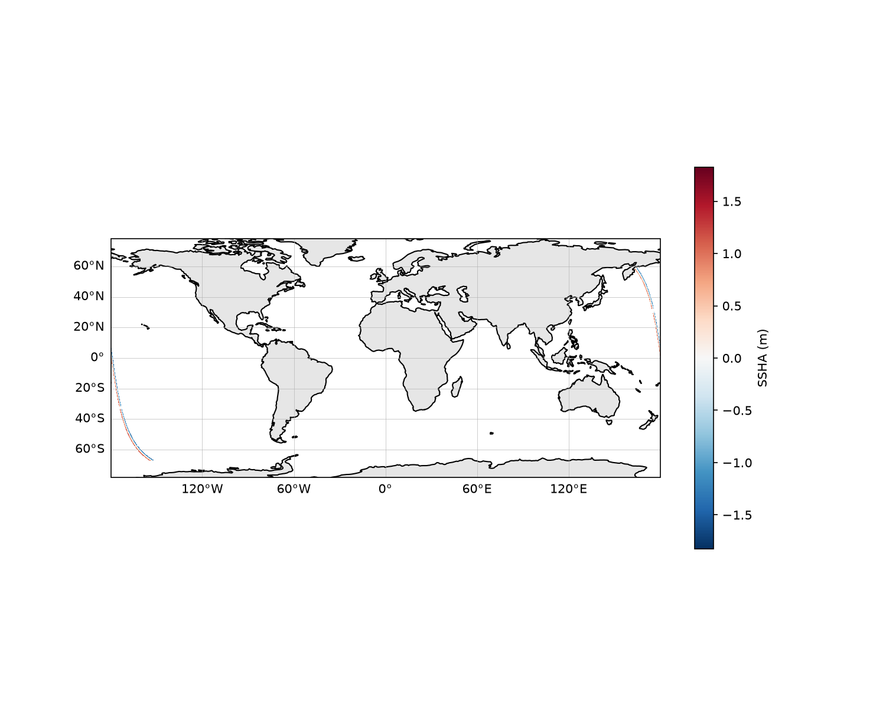
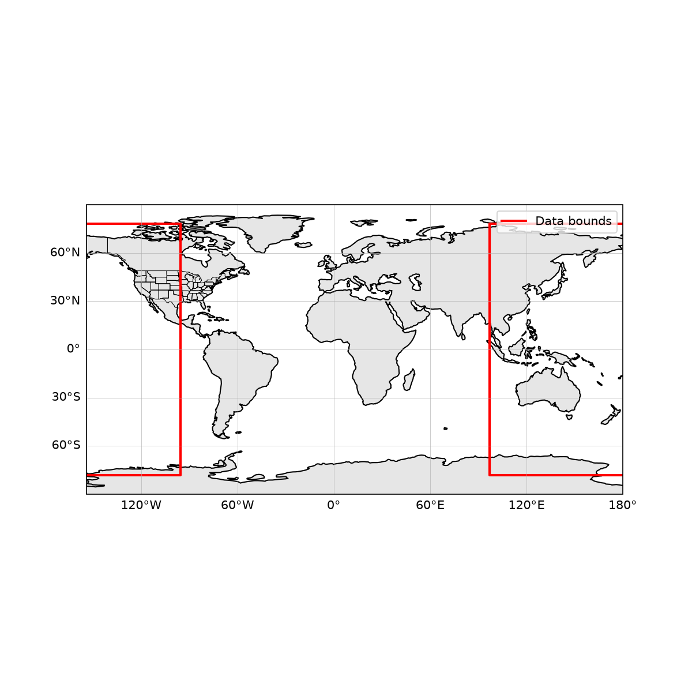

# SWOT Sea Surface Height Example

A standalone Python example that opens a SWOT (Surface Water and Ocean
Topography) Level 2 KaRIn Low Rate Sea Surface Height product and plots
sea surface height anomaly (SSHA). It mirrors the `examples/nisar/`
structure and uses the same tools: `xarray`, `netCDF4`, `matplotlib`,
`cartopy`, and `earthaccess`.

This example is **not** built or tested by NEP's CMake/CTest suite; it is
a plain, standalone Python script demonstrating how to open a
CF/netCDF-compliant science file and visualize it. It does not exercise
any NEP UDF format reader — SWOT L2_LR_SSH files are already
netCDF-4-compatible, so they open directly with `xarray`/`netCDF4`.

## SWOT L2_LR_SSH Data

The [SWOT L2_LR_SSH](https://podaac.jpl.nasa.gov/dataset/SWOT_L2_LR_SSH_D)
product provides near-global, KaRIn-derived sea surface height and sea
surface height anomaly. The `Basic` sub-product (`SWOT_L2_LR_SSH_Basic_D`)
is the smallest of the family and is the one used here.

SWOT L2_LR_SSH files are large (tens to hundreds of MB per half-orbit
granule) and are **not** bundled with this repository. You must provide a
path to a local `.nc` file, or use `--bbox` to search and download one
from NASA Earthdata/PO.DAAC.

> **Note:** The example expects the `Basic` product variable names
> (`ssha_karin`, `ssha_karin_qual`). Other sub-products (Expert,
> Windwave, Unsmoothed) and Version C files (`SWOT_L2_LR_SSH_2.0`) use
> slightly different names; the reader tries a list of candidates where
> possible, but the Basic product is the safest starting point.

## Setup

Requires Python >= 3.9. Create a virtual environment and install the
example's dependencies:

```bash
python3 -m venv .venv
.venv/bin/pip install -r examples/swot/requirements.txt
```

This installs `xarray`, `netCDF4`, `matplotlib`, `cartopy`, and
`earthaccess`.

## Running the Example

From the `examples/swot/` directory, run the `swot_example` package
against a local L2_LR_SSH `.nc` file:

```bash
.venv/bin/python -m swot_example /path/to/SWOT_L2_LR_SSH_Basic_*.nc
```

Two PNGs are written to `output/` (untracked): `ssha_map.png` and
`swath_footprint.png`.

Useful flags:

```bash
.venv/bin/python -m swot_example FILE --show             # also display interactively
.venv/bin/python -m swot_example FILE --output-dir figs  # custom output directory
```

### Fetching Data for a Lat/Lon Box

Instead of a local file, a lat/lon bounding box (west, south, east,
north, in degrees) can be given. The tool searches NASA Earthdata/PO.DAAC
for SWOT L2_LR_SSH Basic granules whose footprint intersects the box,
downloads the most recently acquired one into `data/` (untracked), and
plots it. If the granule is already in `data/`, the download is skipped.

```bash
.venv/bin/python -m swot_example --bbox -45 35 -37 41
```

Downloading requires a free
[NASA Earthdata Login](https://urs.earthdata.nasa.gov/) account.
Credentials are read from `~/.netrc` (or the
`EARTHDATA_USERNAME`/`EARTHDATA_PASSWORD` environment variables), falling
back to an interactive prompt. Example `~/.netrc` entry (set
`chmod 600 ~/.netrc`):

```
machine urs.earthdata.nasa.gov
    login YOUR_USERNAME
    password YOUR_PASSWORD
```

## Example Output

The sample images below were produced from
`SWOT_L2_LR_SSH_Basic_032_140_20250503T000222_20250503T005350_PIC2_01.nc`
— a half-orbit Basic granule over the Pacific.



*Sea surface height anomaly (m) from a sample SWOT L2_LR_SSH Basic
granule. Pixels with a non-zero `ssha_karin_qual` value are masked and
shown as transparent. The two KaRIn swaths are visible on either side of
the nadir gap. The color scale is a diverging `RdBu_r` centered on zero.
The figure was generated with `cartopy` PlateCarree projection and
110m coastlines.*



*Footprint overview: the granule's lat/lon bounding box (red) plotted on
a padded global map with coastlines. A half-orbit granule can span a
wide latitude range, so the overview is naturally near-global.*

## Package Layout

- `swot_example/l3_ssh.py` — reads `ssha_karin` and quality-masks it
  using `ssha_karin_qual`, returning an `xarray.DataArray` with
  `latitude` and `longitude` coordinates.
- `swot_example/plots.py` — `cartopy`/`matplotlib` plotting helpers for
  the SSHA map and swath footprint.
- `swot_example/fetch.py` — NASA Earthdata (CMR) search/download via
  `earthaccess`, used by `--bbox`.
- `swot_example/cli.py` — command-line entry point (`python -m swot_example`).
